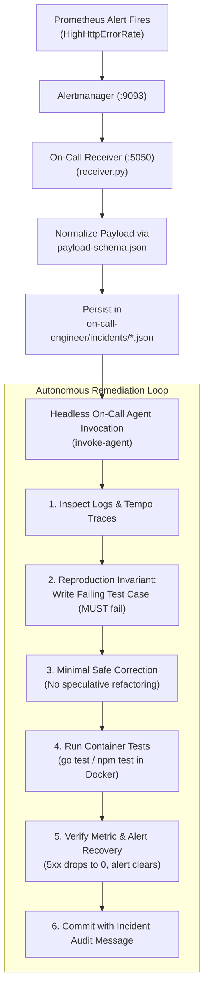

# Actionable Alerting & Autonomous Incident Response Specification (`_docs/alerts-and-incidents.md`)

This document defines the production alerting architecture (Gate 11) and autonomous incident remediation system (Gate 12) for ChoreSync, adhering to the AI-Native Spec-Driven Development constitution.

---

## 1. Gate 11: Actionable Alert Design Standard

Alerts are designed strictly around user-impacting symptoms rather than raw infrastructure noise, enforcing the mandatory telemetry metadata invariants and non-arbitrary durations.

### 1.1 Alerting Rules Matrix (`observability/prometheus/alert_rules.yml`)

| Alert Name | Severity | Breached Signal & Threshold | Sustained Window | Mandatory Labels | Runbook & Triage |
| :--- | :--- | :--- | :--- | :--- | :--- |
| **`HighHttpErrorRate`** | `critical` | HTTP 5xx rate > 5% of total requests | `30s` (dev) / `1m` (prod) | `service: api-backend`<br>`environment: development`<br>`version: dev-latest`<br>`owner: backend-team` | [`runbook.md#high-http-error-rate`](../on-call-engineer/runbook.md#high-http-error-rate) |
| **`HighRequestLatency`** | `warning` | P95 latency > 1.0s across HTTP routes | `1m` | `service: api-backend`<br>`environment: development`<br>`version: dev-latest`<br>`owner: backend-team` | [`runbook.md#high-request-latency`](../on-call-engineer/runbook.md#high-request-latency) |
| **`DatabaseQueryErrors`** | `critical` | Database SQL error rate > 0.05 errors/sec | `30s` | `service: api-backend`<br>`environment: development`<br>`version: dev-latest`<br>`owner: backend-team` | [`runbook.md#database-query-errors`](../on-call-engineer/runbook.md#database-query-errors) |

### 1.2 Mandatory Alert Attributes
Every alert rule definition strictly complies with Rule 11 of `AGENTS.md`:
- **Labels**: `service`, `environment`, `version`, `owner`, `severity`.
- **Annotations**: `summary`, `description`, `dashboard_url`, `runbook_url`.
- **Threshold & Duration**: Explicit, symptom-based thresholds with sustained durations preventing false alarms from transient blips.

### 1.3 Routing Architecture (Alertmanager)
- **Engine**: Prometheus evaluates `observability/prometheus/alert_rules.yml` every 5 seconds.
- **Router**: Prometheus dispatches firing alerts to Alertmanager on `alertmanager:9093`.
- **Webhook**: Alertmanager routes alerts to the containerized receiver at `http://on-call-receiver:5050/webhook`.

---

## 2. Gate 12: Autonomous Incident Response Safety Contract

When an alert triggers, an autonomous AI reliability engineer investigates, reproduces, fixes, and verifies the incident within bounded safety constraints.



### 2.1 Artifact Directory Structure (`on-call-engineer/`)

```
on-call-engineer/
├── payload-schema.json          # Machine-verifiable JSON Schema for alert payloads
├── prompt.md                    # Standalone system prompt for headless on-call agent execution
├── runbook.md                   # Triage runbook for HighHttpErrorRate, HighRequestLatency, DB errors
├── receiver.py                  # Webhook receiver & payload normalizer (port 5050)
├── incidents/                   # Structured ledger of received incidents (JSON)
│   └── inc-<timestamp>-<alert>.json
└── scripts/
    ├── receive-alert            # CLI ingestion & normalization utility
    ├── invoke-agent             # Prepares autonomous agent context & directives
    ├── trigger-test-incident    # Injects synthetic 500 error burst & verifies delivery
    └── verify                   # Complete 6-check verification test suite
```

### 2.2 Core Invariants

1. **Reproduction Invariant**: The on-call agent is **strictly prohibited** from altering application code without first establishing a reproducible test failure in an automated test suite.
2. **Minimal Safe Fix**: The agent must implement the smallest safe correction directly addressing the root cause, preserving existing `contracts/openapi.yaml` contracts.
3. **Container-Native Execution**: All verification tests execute inside containers (`docker compose run --rm backend go test ...`). Host probing is banned.
4. **Telemetry & Recovery Verification**: The agent verifies that the telemetry metric drops below the alert threshold and the Prometheus alert status returns to inactive.
5. **Structured Audit Trail**: Changes are committed with an incident remediation commit referencing the incident ID, alert name, root cause, reproduction test, and verification proof.

---

## 3. Verification & Operational Commands

```bash
# Run the complete autonomous incident response verification suite
make oncall-verify

# Trigger a synthetic test incident (500 error burst + alert delivery)
make oncall-test

# Check incident ledger in on-call receiver
curl http://localhost:5050/incidents

# Query active Prometheus alert rules
curl http://localhost:9090/api/v1/rules

# Query active firing alerts in Alertmanager
curl http://localhost:9093/api/v2/alerts
```
