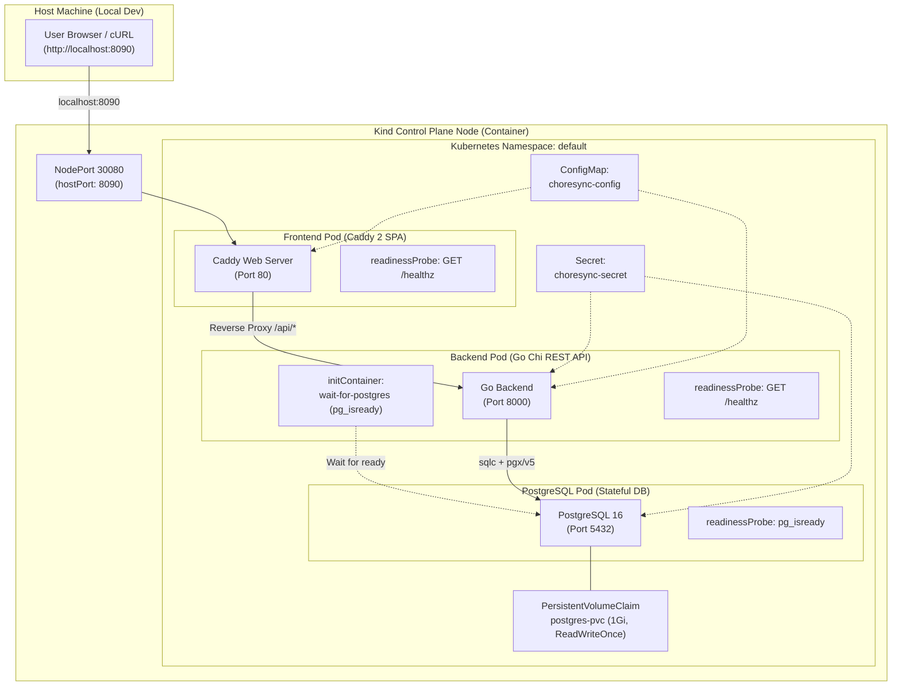

# Gate 10: Local Kubernetes Deployment with Kind (`k8s/`)

This document specifies the architecture, declarative manifests, offline deployment workflow, and automated verification procedures for running **ChoreSync** on a local Kubernetes cluster using **kind** (Kubernetes in Docker).

---

## 1. Architecture & Component Topology



---

## 2. Declarative Manifests in `k8s/`

All Kubernetes resources are version-controlled in the [`k8s/`](../k8s/) directory and bundled via Kustomize:

| File | Resource Kind | Purpose |
| :--- | :--- | :--- |
| [`k8s/kind-cluster-config.yaml`](../k8s/kind-cluster-config.yaml) | `Cluster` (kind) | Defines local cluster with extraPortMapping (hostPort `8090` -> containerPort `30080`). |
| [`k8s/secret.yaml`](../k8s/secret.yaml) | `Secret` | Decoupled credentials: `POSTGRES_USER`, `POSTGRES_PASSWORD`, `DATABASE_URL`, `JWT_SECRET`. |
| [`k8s/configmap.yaml`](../k8s/configmap.yaml) | `ConfigMap` | Non-sensitive configurations: `PORT`, `EMAIL_PROVIDER`, `BACKEND_URL`, environment tags. |
| [`k8s/postgres-pvc.yaml`](../k8s/postgres-pvc.yaml) | `PersistentVolumeClaim` | 1Gi persistent volume claim with `ReadWriteOnce` access mode. |
| [`k8s/postgres-deployment.yaml`](../k8s/postgres-deployment.yaml) | `Deployment` | PostgreSQL 16 container mounting PVC at `/var/lib/postgresql/data` with `PGDATA` subpath. |
| [`k8s/postgres-service.yaml`](../k8s/postgres-service.yaml) | `Service` | ClusterIP service exposing PostgreSQL port `5432` internally. |
| [`k8s/app-deployment.yaml`](../k8s/app-deployment.yaml) | `Deployment` | Backend API (with initContainer) & Frontend Caddy reverse proxy. |
| [`k8s/app-service.yaml`](../k8s/app-service.yaml) | `Service` | Backend ClusterIP (`8000`) and Frontend NodePort (`30080`). |
| [`k8s/kustomization.yaml`](../k8s/kustomization.yaml) | `Kustomization` | Unified bundle orchestrating atomic deployment via `kubectl apply -k k8s/`. |
| [`k8s/verify`](../k8s/verify) | Shell Script | Automated verification gate checking PVC status, pod readiness, and live HTTP endpoints. |

---

## 3. Key Invariants & Safeguards

### 3.1 Persistent Database Storage Invariant
- PostgreSQL data directory mounts `postgres-pvc` with `accessModes: [ReadWriteOnce]`.
- Configured with `PGDATA: /var/lib/postgresql/data/pgdata` to prevent filesystem conflicts with standard `lost+found` directories on ext4 volumes.
- Database records, user accounts, and chore states persist across pod restarts and rollout updates.

### 3.2 Mandatory Readiness & Liveness Checks
Every pod declares explicit, non-overlapping readiness and liveness probes:
- **PostgreSQL**:
  - `readinessProbe`: `exec: command: ["pg_isready", "-U", "choresync", "-d", "choresync"]` (checks socket accept & DB readiness).
  - `livenessProbe`: `exec: command: ["pg_isready", "-U", "choresync", "-d", "choresync"]`.
- **Backend API**:
  - `initContainer`: `wait-for-postgres` blocks application startup until PostgreSQL passes `pg_isready`.
  - `readinessProbe`: `httpGet: {path: /healthz, port: 8000}`.
  - `livenessProbe`: `httpGet: {path: /healthz, port: 8000}`.
- **Frontend / Reverse Proxy**:
  - `readinessProbe`: `httpGet: {path: /healthz, port: 80}`.
  - `livenessProbe`: `httpGet: {path: /healthz, port: 80}`.

### 3.3 Offline Image Loading (Zero Remote Registry Dependency)
- Development images are built locally and loaded directly into the Kind node:
  ```bash
  kind load docker-image choresync-backend:dev-latest --name choresync-cluster
  kind load docker-image choresync-frontend:dev-latest --name choresync-cluster
  kind load docker-image postgres:16-alpine --name choresync-cluster
  ```
- All deployment manifests enforce `imagePullPolicy: IfNotPresent`, eliminating public registry roundtrips and rate limits.

---

## 4. Standard Operational Commands

| Action | Command | Description |
| :--- | :--- | :--- |
| **Full Lifecycle Deploy** | `make k8s-up` | Provisions kind cluster, loads images, applies manifests, and verifies readiness. |
| **Verify Readiness** | `make k8s-verify` | Executes [`k8s/verify`](../k8s/verify) automated verification suite. |
| **Inspect Pods** | `kubectl get pods -o wide` | Displays pod status, IP addresses, and restart counts. |
| **Inspect Logs** | `make k8s-logs` | Tails logs across frontend and backend pods. |
| **Teardown Cluster** | `make k8s-down` | Deletes the local kind cluster and cleans up resources. |

---

## 5. Automated Verification Output

The [`k8s/verify`](../k8s/verify) script executes 7 sequential checks:
1. `kubectl cluster-info` connectivity verification.
2. `postgres-pvc` status check (`Bound`).
3. PostgreSQL pod readiness condition (`1/1 Ready`).
4. Backend deployment rollout status (`deployment "backend" successfully rolled out`).
5. Frontend deployment rollout status (`deployment "frontend" successfully rolled out`).
6. Global pod table inspection.
7. Live HTTP probe on `http://localhost:8090/healthz` and `http://localhost:8090/api/v1/households`.
