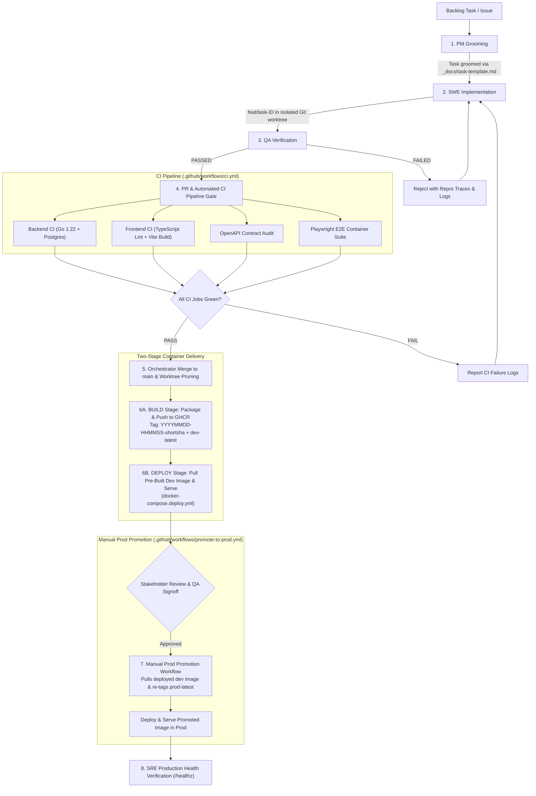

# ChoreSync Multi-Agent Orchestration Process

This document defines the operational workflow, lifecycle loops, delegation rules, container registry build/deploy stages, and manual production promotion gates for the multi-agent engineering team (Orchestrator, PM, SWE, QA, SRE).

---

## 1. Core Development Loop

For every backlog task or feature issue from `_docs/tasks.md` (or GitHub issues):



### Step 1: PM Grooming (`_docs/team/pm.md`)
- The PM agent grooms each task using the template in [`_docs/task-template.md`](task-template.md).
- Validates the acceptance criteria, file boundaries, and scope strictly against [`_docs/specs.md`](specs.md) and [`contracts/openapi.yaml`](../contracts/openapi.yaml).
- Updates task state in [`_docs/tasks.md`](tasks.md) (`TODO` → `IN_PROGRESS`).

### Step 2: Implementation (SWE Agent - `_docs/team/swe.md`)
- The SWE agent creates an isolated Git worktree:
  ```bash
  git worktree add .worktrees/task-<ID> -b feat/task-<ID>
  ```
- Implements the feature, adhering strictly to the contract (`contracts/openapi.yaml`).
- Writes container-runnable unit and integration tests.
- Performs containerized pre-flight checks inside the isolated worktree:
  ```bash
  docker compose run --rm frontend npm run lint
  docker compose run --rm backend go test -v ./...
  ```
- Marks task as `READY_FOR_QA`.

### Step 3: Verification (QA Agent - `_docs/team/qa.md`)
- The QA agent evaluates the branch in a **clean, fresh context** to prevent context rot or hallucinations.
- Validates against the manual test scenario ([`_docs/manual-test.md`](manual-test.md)) and automated test suite.
- Confirms the active running containers gate (`docker compose ps` shows services `Up`).
- Verifies live API endpoints return 200 OK over HTTP.
- **If PASSED**:
  - Marks task status as `READY_FOR_CI`.
  - Opens/updates pull request for CI verification.
- **If FAILED**:
  - Rejects task and returns to SWE with exact reproduction traces, error messages, and failed assertion logs.

### Step 4: Automated CI Pipeline Gate (`.github/workflows/ci.yml`)
- Triggered automatically on Pull Request or branch push via GitHub Actions.
- Runs the automated verification matrix:
  1. **Backend CI**: Go 1.22 `go vet`, race condition detection, and unit/store tests against a live PostgreSQL 16 service container.
  2. **Frontend CI**: TypeScript strict compilation (`npm run lint`) and Vite production bundling (`npm run build`).
  3. **Contract Audit**: Validates `contracts/openapi.yaml` existence and YAML schema validity.
  4. **E2E Integration CI**: Spins up the container stack and executes the full 11-journey Playwright test suite in headless mode.
- **Strict Invariant**: The Orchestrator is **STRICTLY PROHIBITED** from merging any branch where any CI check fails.

### Step 5: Orchestration, Merge & Worktree Pruning
- Upon green QA and CI verification, the Orchestrator merges `feat/task-<ID>` into `main`.
- Removes the worktree and cleans up the branch:
  ```bash
  git worktree remove .worktrees/task-<ID>
  git branch -d feat/task-<ID>
  ```
- Updates [`_docs/tasks.md`](tasks.md) marking the task as `DONE`.

### Step 6: Two-Stage Container Delivery (Build vs Deploy)
Deployment is decoupled into two explicit, independent stages:

#### 6A. Build Stage (Package & Push to Registry)
- Builds production-ready multi-stage Docker images with zero host dependency.
- Stamped with the mandatory **`YYYYMMDD-HHMMSS-shortsha`** tag pattern (e.g. `20260818-163457-83242da`).
- Pushes both the versioned timestamp tag and `dev-latest` to GitHub Container Registry (`ghcr.io`):
  - `ghcr.io/<repo>/backend:YYYYMMDD-HHMMSS-shortsha`
  - `ghcr.io/<repo>/frontend:YYYYMMDD-HHMMSS-shortsha`
  - `ghcr.io/<repo>/backend:dev-latest`
  - `ghcr.io/<repo>/frontend:dev-latest`
- Uploads deployment metadata artifact `dev-deployed-image-tag`.

#### 6B. Deploy Stage (Pull & Serve)
- Pulls the pre-built images directly from the container registry:
  ```bash
  docker pull ghcr.io/<repo>/backend:dev-latest
  docker pull ghcr.io/<repo>/frontend:dev-latest
  ```
- Serves the stack using `docker-compose.deploy.yml` with **zero compiler or source build overhead**.
- Executes live HTTP healthcheck (`/healthz`) to verify successful boot.

### Step 7: Manual Production Promotion (`.github/workflows/promote-to-prod.yml`)
Production follows the **"Build Once, Promote Everywhere"** standard:
- Production **never recompiles** code from source.
- An authorized stakeholder triggers the **Promote Dev Image to Prod** workflow.
- The workflow:
  1. Pulls the currently deployed dev image (`dev-latest` or specified `YYYYMMDD-HHMMSS-shortsha` tag).
  2. Inspects SHA256 image digest to verify immutability.
  3. Re-tags for production (`YYYYMMDD-HHMMSS-shortsha-prod` and `prod-latest`) and pushes to registry.
  4. Pulls and serves the promoted image in the production environment.
  5. Records an immutable promotion audit log in GitHub Actions summary.

### Step 8: Post-Deploy Telemetry & Health Verification (`_docs/team/sre.md`)
- The SRE agent verifies the deployed application:
  - Validates live `/healthz` HTTP endpoint.
  - Verifies Caddy reverse proxy routing, HTTP compression, and SSL/TLS certificates.
  - Confirms database connection pool stability on Neon Serverless PostgreSQL.

---

## 2. Multi-Agent Team Rules

1. **The Orchestrator Never Writes Code**: The orchestrator only plans, tracks, dispatches tasks, and merges verified branches. It NEVER writes application code directly.
2. **Strict Worktree Isolation**: Subagents NEVER work directly on `main` simultaneously. Every implementation task must take place in an isolated worktree branch.
3. **Clean-Context QA**: QA verification must occur with independent evaluation context, validating against [`_docs/manual-test.md`](manual-test.md) and test scripts.
4. **Contract-First Immutability**: Neither SWE nor QA may mutate [`contracts/openapi.yaml`](../contracts/openapi.yaml) unilaterally. Contract modifications require explicit PM audit and regeneration.
5. **Universal Error Handling**: Any newly introduced API endpoints must return errors adhering to the standard JSON error schema:
   ```json
   {
     "error": "ERROR_CODE",
     "message": "Human-readable description",
     "code": 400,
     "details": {}
   }
   ```
6. **Mandatory CI Gate Before Merge**: No branch may be merged into `main` without 100% passing status on all GitHub Actions CI checks (`backend-ci`, `frontend-ci`, `contract-audit`, `e2e-ci`). Local tests are necessary pre-flights, but centralized CI is the definitive source of truth.
7. **Immutable Promotion Invariant**: Production environments must always pull the pre-built, tested image that was already deployed to dev. Rebuilding images during production promotion is strictly prohibited.
