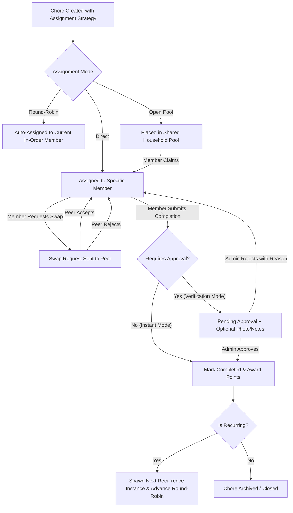
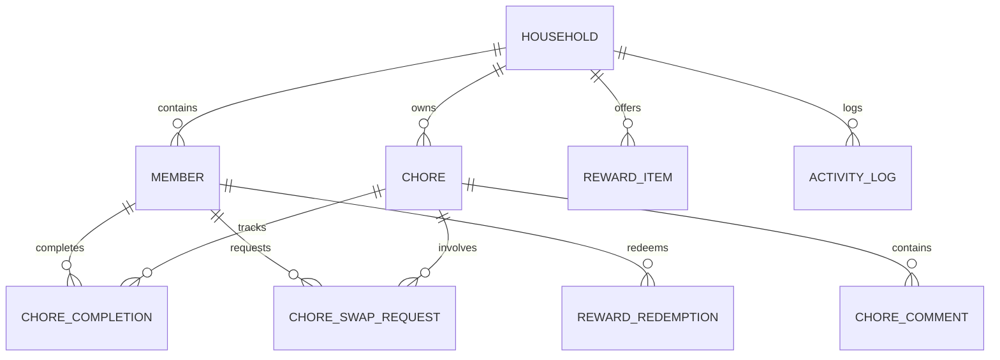

# Household Chores Management System (ChoreSync) Specification

## 1. Problem Statement & Scope

### 1.1 Core Value Proposition
Managing shared household responsibilities frequently causes friction, uneven workload distribution, and communication breakdowns across living arrangements. **ChoreSync** is an equitable, flexible household chore coordination system designed to adapt seamlessly across three core household dynamics:
1. **Flatmates / Roommates**: Peer-to-peer accountability, automated round-robin rotations, chore trading/swapping, and transparent contribution histories without requiring a centralized authority.
2. **Families with Children**: Role hierarchy (Parents/Admins vs Children/Members), chore assignment, verification/approval gates before awarding points or allowances, and motivating gamification.
3. **Couples / Lightweight Shared Households**: Low-overhead shared chore backlogs, voluntary task claiming, quick one-tap completions, and gentle reminder nudges without bureaucratic overhead.

### 1.2 Target Personas
- **The Roommate / Flatmate**: Wants fair distribution, transparent visibility into who did what, the ability to trade or swap chores when busy, and automated rotation so no single person has to "nag".
- **The Parent / Household Admin**: Wants to define recurring routines for family members, inspect completed work, approve or reject task submissions with feedback, and incentivize positive habits via points and rewards.
- **The Child / Dependent Member**: Wants an intuitive, visual checklist showing assigned tasks, clear point values, straightforward submission (with optional photo proof), and milestone tracking.
- **The Partner / Casual Co-liver**: Wants a friction-free shared board to see what needs to be done around the home, claim open tasks spontaneously, and mark them completed in a single tap.

### 1.3 Out of Scope (Explicit Anti-Goals for v1)
- **Real-Money Financial Processing**: No integration with banking APIs, Stripe, PayPal, or Venmo for real cash payouts or rent/bill splitting.
- **Dedicated Chat / Instant Messaging**: No standalone instant messaging rooms; all communications are scoped directly to chore comments, reminder nudges, and activity feed entries.
- **Pantry & Grocery Inventory Management**: No barcode scanning, pantry stock tracking, or ingredient lifecycle management.
- **IoT & Smart Appliance Integrations**: No direct hardware integrations with robot vacuums, smart washers, or home automation hubs.
- **Multi-Property Landlord Portals**: No multi-tenant leasing, property management, or maintenance ticketing between tenants and landlords.

---

## 2. System Architecture (Functional)

### 2.1 Functional Component Breakdown
- **Household & Member Management**: Manages household workspace setup, invite codes, member profiles, and role-based permissions (`Admin`, `Member`, `Child`).
- **Chore Scheduling & Assignment Engine**: Supports one-off and recurring schedules (daily, weekly, bi-weekly, monthly, custom days of week) with three modular assignment modes:
  - *Direct Assignment*: Assigned to a specific member.
  - *Automated Round-Robin*: Automatically advances through an ordered list of members upon each recurrence cycle.
  - *Open Pool*: Unassigned chore available in a shared pool for any member to claim or pick up.
- **Verification & Lifecycle Workflow**:
  - *Instant Self-Completion*: One-click mark as done for trusted or low-stakes tasks.
  - *Approval Gate*: Optional `requires_approval` flag requiring an Admin/Parent to verify before status finalizes and points are credited.
  - *Proof Submission*: Optional notes and photo attachment for completed chores.
  - *Overdue Rollover*: Overdue chores persist with visual status alerts and rollover until resolved.
- **Chore Swap & Trade Marketplace**: Enables members to propose trading an assigned chore with a peer or posting it to the open swap board for anyone to take over.
- **Gamification & Rewards Engine**: Tracks point balances, chore streaks, badges, and a household-customizable reward catalog (e.g. movie night pick, exemption from dishes, special treat).
- **Activity Feed & Notification Hub**: Live household audit log tracking chore updates, completion events, approval requests, nudges, and trade confirmations.

### 2.2 High-Level Dataflow

---

## 3. Data Entities & Schema Definitions

### 3.1 Entity Model

### 3.2 Detailed Entity Definitions

#### 1. Household
- `id` (UUID, Primary Key): Unique identifier.
- `name` (String, Required): Display name of the household (e.g. "Apartment 4B", "The Miller Family").
- `invite_code` (String, Unique): Alphanumeric code for members to join.
- `settings` (JSON Object):
  - `default_mode` (Enum: `flatmate` | `family` | `casual`): Preconfigures UI views and default rules.
  - `allow_swaps` (Boolean): Enable/disable peer chore trading.
  - `timezone` (String): e.g. "America/New_York".
- `created_at` (Timestamp), `updated_at` (Timestamp).

#### 2. Member
- `id` (UUID, Primary Key): Unique member identifier.
- `household_id` (UUID, Foreign Key -> Household.id): Associated household.
- `name` (String, Required): Member display name.
- `avatar_url` (String, Optional): Profile image or avatar ID.
- `role` (Enum: `admin` | `member` | `child`):
  - `admin`: Full management (create/edit/delete chores, approve tasks, manage rewards and members).
  - `member`: Standard peer (create chores, claim/complete chores, propose swaps, redeem rewards).
  - `child`: Simplified workflow (complete assigned chores, submit proof, request reward redemptions; cannot self-approve or edit chore rules).
- `points_balance` (Integer, Default: 0): Current spendable gamification points.
- `total_points_earned` (Integer, Default: 0): Lifetime points for leaderboards and streaks.
- `created_at` (Timestamp), `updated_at` (Timestamp).

#### 3. Chore
- `id` (UUID, Primary Key): Unique chore identifier.
- `household_id` (UUID, Foreign Key -> Household.id): Household context.
- `title` (String, Required): e.g. "Take out recycling", "Mop kitchen floor".
- `description` (Text, Optional): Specific task instructions or checklist items.
- `category` (Enum: `cleaning` | `kitchen` | `yard` | `pets` | `maintenance` | `other`).
- `effort_points` (Integer, Default: 10): Points awarded upon verified completion.
- `assignment_type` (Enum: `direct` | `round_robin` | `open_pool`):
  - `direct`: Assigned to `current_assignee_id`.
  - `round_robin`: Rotates among `rotation_member_ids`.
  - `open_pool`: Available for any eligible member to pick up.
- `current_assignee_id` (UUID, Foreign Key -> Member.id, Nullable): Currently assigned member (null if open pool).
- `rotation_member_ids` (Array of UUIDs, Optional): Ordered sequence of members for round-robin rotation.
- `current_rotation_index` (Integer, Default: 0): Index pointing to the next member in `rotation_member_ids`.
- `recurrence_type` (Enum: `none` | `daily` | `weekly` | `monthly` | `custom_days`).
- `recurrence_rule` (JSON Object, Optional): E.g. `{"days": ["mon", "thu"]}` for custom day cadence.
- `due_date` (Timestamp, Optional): Due date/time for the current instance.
- `requires_approval` (Boolean, Default: false): If true, completion must be verified by an `admin`.
- `requires_proof` (Boolean, Default: false): If true, completion requires a photo or note submission.
- `status` (Enum: `unassigned` | `assigned` | `in_progress` | `pending_approval` | `completed` | `overdue`).
- `created_by` (UUID, Foreign Key -> Member.id): Creator.
- `created_at` (Timestamp), `updated_at` (Timestamp).

#### 4. ChoreCompletion
- `id` (UUID, Primary Key): Unique record of a completion instance.
- `chore_id` (UUID, Foreign Key -> Chore.id): Associated chore.
- `member_id` (UUID, Foreign Key -> Member.id): Member who completed the chore.
- `status` (Enum: `approved` | `rejected` | `pending_approval`):
  - Automatically `approved` if `requires_approval` is false.
- `proof_notes` (Text, Optional): Notes left by the member.
- `proof_photo_url` (String, Optional): Uploaded photo proof.
- `approved_by` (UUID, Foreign Key -> Member.id, Nullable): Admin who approved the completion.
- `rejection_reason` (Text, Optional): Feedback if rejected/returned for re-work.
- `points_awarded` (Integer, Default: 0): Points credited to the completing member.
- `completed_at` (Timestamp), `verified_at` (Timestamp, Nullable).

#### 5. ChoreSwapRequest
- `id` (UUID, Primary Key): Unique swap proposal.
- `chore_id` (UUID, Foreign Key -> Chore.id): The chore being offered.
- `requester_id` (UUID, Foreign Key -> Member.id): Member proposing the swap.
- `target_member_id` (UUID, Foreign Key -> Member.id, Nullable): Specific peer (or null if open to the entire household).
- `status` (Enum: `pending` | `accepted` | `rejected` | `cancelled`).
- `reason` (String, Optional): E.g. "Studying for exam tonight".
- `created_at` (Timestamp), `resolved_at` (Timestamp, Nullable).

#### 6. RewardItem & RewardRedemption
- **RewardItem**:
  - `id` (UUID, Primary Key), `household_id` (UUID, Foreign Key).
  - `title` (String), `description` (Text), `points_cost` (Integer, Required).
  - `icon` (String, Optional), `is_active` (Boolean, Default: true).
- **RewardRedemption**:
  - `id` (UUID, Primary Key), `household_id` (UUID), `member_id` (UUID), `reward_item_id` (UUID).
  - `points_spent` (Integer), `status` (Enum: `requested` | `fulfilled` | `cancelled`).
  - `requested_at` (Timestamp), `fulfilled_at` (Timestamp, Nullable).

#### 7. ActivityLog & Notification
- `id` (UUID, Primary Key), `household_id` (UUID).
- `recipient_id` (UUID, Foreign Key -> Member.id, Nullable): Target user (null if broadcast to household).
- `actor_id` (UUID, Foreign Key -> Member.id): User who triggered the event.
- `event_type` (Enum: `chore_created` | `chore_assigned` | `chore_completed` | `approval_requested` | `chore_approved` | `chore_rejected` | `swap_proposed` | `swap_accepted` | `chore_nudge` | `reward_redeemed`).
- `entity_type` (String: "chore", "swap", "reward"), `entity_id` (UUID).
- `message` (String, Required): Human-readable event description.
- `read` (Boolean, Default: false).
- `created_at` (Timestamp).

---

## 4. API & Interface Specifications (Functional)

### 4.1 Household & Member Operations
- `POST /api/households`: Create a new household workspace (sets name, default mode, initial admin).
- `POST /api/households/join`: Join an existing household using an invite code.
- `GET /api/households/{id}`: Retrieve household details, settings, and member directory.
- `PATCH /api/households/{id}/settings`: Update household preferences and defaults.
- `POST /api/households/{id}/members`: Invite or manually add a member (e.g. child profile).
- `GET /api/households/{id}/members`: List members with roles, current points, and streak status.

### 4.2 Chore Management Operations
- `GET /api/households/{id}/chores`: Query chores with filters (`status`, `assignee_id`, `category`, `due_date`).
- `POST /api/households/{id}/chores`: Create a chore definition (assignment rules, recurrence cadence, approval flags).
- `GET /api/chores/{chore_id}`: Retrieve detailed chore card, history, and comments.
- `PATCH /api/chores/{chore_id}`: Update chore details, assignment strategy, or recurrence schedule.
- `DELETE /api/chores/{chore_id}`: Delete or archive a chore.
- `POST /api/chores/{chore_id}/claim`: Claim an open pool chore or self-assign.

### 4.3 Completion & Verification Operations
- `POST /api/chores/{chore_id}/complete`: Submit chore completion with optional `proof_notes` and `proof_photo_url`.
  - If `requires_approval == false`: Instantly transitions status to `completed`, awards points, advances round-robin, and schedules next recurrence.
  - If `requires_approval == true`: Transitions status to `pending_approval` and sends verification alert to Admins.
- `POST /api/completions/{completion_id}/approve`: Admin verifies and approves completion (finalizes points and triggers next cycle).
- `POST /api/completions/{completion_id}/reject`: Admin rejects completion with a required `rejection_reason`; chore status reverts to `assigned`.

### 4.4 Chore Swapping Operations
- `POST /api/chores/{chore_id}/swap`: Propose a swap for an assigned chore to a specific member or post to the household swap board.
- `POST /api/swaps/{swap_id}/accept`: Target peer accepts the swap; system transfers `current_assignee_id`.
- `POST /api/swaps/{swap_id}/reject`: Target peer declines the swap.
- `DELETE /api/swaps/{swap_id}`: Requester cancels the swap request.

### 4.5 Gamification, Rewards & Social Interactions
- `GET /api/households/{id}/rewards`: Retrieve active household reward catalog.
- `POST /api/households/{id}/rewards`: Admin creates a new reward item (title, points cost).
- `POST /api/rewards/{reward_id}/redeem`: Member spends points to request a reward item.
- `POST /api/redemptions/{redemption_id}/fulfill`: Admin marks reward as fulfilled.
- `POST /api/chores/{chore_id}/nudge`: Send a friendly, pre-canned reminder nudge to the current assignee.
- `POST /api/chores/{chore_id}/comments`: Post a comment on a chore discussion thread.
- `GET /api/households/{id}/activity`: Retrieve timeline of recent household chore activity and milestones.

### 4.6 Authentication, Magic Links & Multi-Tenancy Operations
- `POST /api/auth/register`: Register new household administrator with credentials.
- `POST /api/auth/login`: Authenticate existing member with email and password.
- `POST /api/auth/magic-link`: Request 1-click passwordless magic login link.
- `GET /api/auth/verify`: Validate magic login token and generate authenticated JWT claims.
- `POST /api/auth/forgot-password`: Request password reset email token.
- `POST /api/auth/reset-password`: Set new password using 1-hour reset token.
- `POST /api/auth/supabase-login`: Exchange verified Supabase Auth JWT access token for ChoreSync session claims and auto-provision user profile.
- `POST /api/auth/demo-login`: Quick-switch persona login for local evaluation and shared tablet testing.

---

## 5. Non-Functional Requirements

### 5.1 User Experience & Accessibility
- **Mobile-First Responsive Interface**: Highly responsive touch layout optimized for quick phone check-offs, tablet family boards, and desktop browsers.
- **Micro-Friction Interaction**: Checking off an instant chore must take exactly 1 tap from the dashboard.
- **Visual Clarity & Roles**: Intuitive visual indicators for roles and states (e.g. kid-friendly colorful icons and badges, clear badges for overdue vs pending approval).
- **Graceful Tone**: Reminders and nudges use gentle, non-aggressive phrasing ("Gentle nudge: recycling is tomorrow morning!").

### 5.2 Performance & Responsiveness
- **Fast Dashboard Load**: Dashboard load and chore list query under 200ms under standard household data volumes.
- **Optimistic UI Updates**: Tapping "Complete" immediately reflects state change in the UI with background sync.

### 5.3 Reliability & Data Integrity
- **Auditability**: Complete audit history for all chore completions, approvals, rejections, and point modifications.
- **Idempotent Recurrence**: Automated recurrence generation must be idempotent to prevent duplicate instances for the same cycle.
