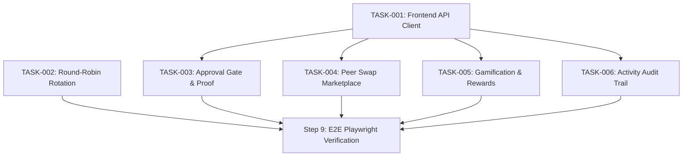

# ChoreSync Task Backlog (`_docs/tasks.md`)

This document tracks all implementation, testing, and infrastructure tasks for **ChoreSync** during **Step 8: Multi-Agent Task Orchestration**.

---

## 1. Task Ledger & Kanban Board

| Task ID | Title | Owner / Role | Status | Worktree / Branch | Dependencies |
| :--- | :--- | :--- | :---: | :--- | :--- |
| **TASK-001** | Frontend Service Integration with Real Backend API | QA | `DONE` | `feat/task-001-api-client` | None |
| **TASK-002** | Round-Robin Auto-Rotation & Recurrence Engine | SWE | `DONE` | `feat/task-002-rotation` | None |
| **TASK-003** | Parent/Admin Verification Gate & Proof Submission | SWE | `DONE` | `feat/task-003-approval-gate` | TASK-001 |
| **TASK-004** | Peer Chore Swap Marketplace & Negotiation | SWE | `DONE` | `feat/task-004-swap-market` | TASK-001 |
| **TASK-005** | Gamification Engine, Streaks & Reward Redemptions | SWE | `DONE` | `feat/task-005-gamification` | TASK-001 |
| **TASK-006** | Activity Log Audit Trail & Notification Hub | SWE | `DONE` | `feat/task-006-activity-hub` | TASK-001 |
| **TASK-007** | Stateless Auth, Magic Links & Multi-Tenancy Isolation | SWE | `DONE` | `feat/task-007-auth-multi-tenant` | None |
| **TASK-008** | Persistent Database Migration (`sqlc` + PostgreSQL) | SWE | `DONE` | `feat/task-008-postgres-sqlc` | None |
| **TASK-009** | External Email & Notification Integration | SWE | `DONE` | `feat/task-009-email-notifications` | None |
| **TASK-010** | Cloud Deployment & Production Hardening (Render + Neon + Caddy) | SRE | `DONE` | `feat/task-010-cloud-deployment` | None |
| **TASK-011** | Actionable Alerting & Autonomous Incident Response (Gates 11 & 12) | SRE | `DONE` | `feat/task-011-alerts-incident-response` | None |
| **TASK-012** | Local Kubernetes Deployment with Kind (Gate 10) | SRE | `DONE` | `feat/task-012-k8s-kind` | None |
| **TASK-013** | Local Cloud Emulator Integration (Floci: S3 + SQS) | SRE / SWE | `DONE` | `feat/task-013-cloud-emulator` | None |

---

## 2. Dependency Graph

---

## 3. Detailed Groomed Tasks

---

### TASK-001: Frontend Service Integration with Real Backend API

## Objective
Connect the React frontend service layer (`frontend/src/services/api.ts`) to the Go backend HTTP API running at `/api/v1`, replacing pure local mock storage with contract-compliant HTTP calls while maintaining offline fallback.

## Context
- Specs: [`_docs/specs.md`](specs.md) (Section 2.1)
- Contract: [`contracts/openapi.yaml`](../contracts/openapi.yaml) (All `/api/v1/households/*` endpoints)
- Manual Test Journey: [`_docs/manual-test.md`](manual-test.md) (Step 1)

## Scope & File Boundaries
- **Assigned Role**: SWE
- **Branch / Worktree**: `feat/task-001-api-client` / `.worktrees/task-001`
- **Files to create or modify**:
  - `frontend/src/services/api.ts`
  - `frontend/src/services/httpClient.ts` (new)
  - `frontend/src/services/__tests__/api.test.ts`
  - (No modification to `backend/` or `contracts/openapi.yaml`)

## Subtasks
- [x] Implement `httpClient.ts` configured with base URL `http://localhost:8000/api/v1` and standardized JSON headers
- [x] Connect `getHouseholds()`, `getHousehold(id)`, `getMembers(householdId)`, and `getChores(householdId)` to live backend endpoints
- [x] Implement seamless fallback to local seed data if backend is unreachable or offline
- [x] Add unit tests verifying request/response envelope handling and error transformation
- [x] Run linter and typecheck (`bun run lint` / `npm run typecheck`)

## Acceptance Criteria
- [x] Frontend successfully fetches live data from Go backend when running
- [x] Conforms strictly to `contracts/openapi.yaml` request and response shapes
- [x] Gracefully handles connection failures with informative console warnings and offline fallback
- [x] All frontend unit tests pass (16/16 passing)

---

### TASK-002: Round-Robin Auto-Rotation & Recurrence Engine

## Objective
Ensure the chore scheduling and auto-rotation logic idempotently advances member assignments across round-robin rotations upon chore completion or recurrence triggering.

## Context
- Specs: [`_docs/specs.md`](specs.md) (Section 2.1 & 2.2)
- Contract: [`contracts/openapi.yaml`](../contracts/openapi.yaml) (`/api/v1/households/{householdId}/chores/{choreId}/rotate`)
- Manual Test Journey: [`_docs/manual-test.md`](manual-test.md) (Step 2)

## Scope & File Boundaries
- **Assigned Role**: SWE
- **Branch / Worktree**: `feat/task-002-rotation` / `.worktrees/task-002`
- **Files to create or modify**:
  - `backend/internal/store/store.go`
  - `backend/internal/handlers/chores.go`
  - `backend/tests/rotation_test.go`
  - (No modification to `frontend/` or `contracts/openapi.yaml`)

## Subtasks
- [x] Validate round-robin rotation handler advances index modulo member list length
- [x] Ensure non-round-robin chores return appropriate error when rotate endpoint is invoked
- [x] Implement recurrence trigger logic to spawn next instance with calculated due date
- [x] Write Go unit and integration tests verifying multiple successive rotations

## Acceptance Criteria
- [x] Calling `POST /api/v1/households/{householdId}/chores/{choreId}/rotate` returns `200 OK` with next assignee ID
- [x] Index wraps around correctly when reaching the end of the rotation list
- [x] Conforms strictly to `contracts/openapi.yaml` schema `Chore`
- [x] Go test suite passes with zero failures

---

### TASK-003: Parent/Admin Verification Gate & Proof Submission

## Objective
Enforce the verification gate workflow: chores requiring approval transition to `pending_approval` upon completion submission, requiring an Admin/Parent to approve or reject before points are credited.

## Context
- Specs: [`_docs/specs.md`](specs.md) (Section 2.1 & 2.2)
- Contract: [`contracts/openapi.yaml`](../contracts/openapi.yaml) (`/api/v1/households/{householdId}/completions/{completionId}/approve`, `/reject`)
- Manual Test Journey: [`_docs/manual-test.md`](manual-test.md) (Steps 4 & 5)

## Scope & File Boundaries
- **Assigned Role**: SWE
- **Branch / Worktree**: `feat/task-003-approval-gate` / `.worktrees/task-003`
- **Files to create or modify**:
  - `backend/internal/handlers/completions.go`
  - `backend/internal/store/store.go`
  - `backend/tests/approval_test.go`
  - `frontend/src/components/ApprovalQueueModal.tsx`

## Subtasks
- [x] Verify that completing a chore with `requires_approval: true` creates a completion with status `pending_approval`
- [x] Verify that member points are NOT incremented while status is `pending_approval`
- [x] Implement approval endpoint: updates status to `approved`, credits points, updates chore recurrence
- [x] Implement rejection endpoint: updates status to `rejected` with rejection reason, returns chore to `todo`
- [x] Ensure non-admin users cannot approve or reject completions

## Acceptance Criteria
- [x] Points balance increases only when approval is granted
- [x] Non-admin approval requests return `403 Forbidden` with standard JSON error envelope
- [x] Conforms strictly to `contracts/openapi.yaml`
- [x] Manual test steps 4 & 5 pass without regression

---

### TASK-004: Peer Chore Swap Marketplace & Negotiation

## Objective
Implement peer-to-peer chore swap proposals, status transitions (`pending` -> `accepted` / `rejected` / `cancelled`), and automatic assignee reassignment upon acceptance.

## Context
- Specs: [`_docs/specs.md`](specs.md) (Section 2.1 & 2.2)
- Contract: [`contracts/openapi.yaml`](../contracts/openapi.yaml) (`/api/v1/households/{householdId}/swaps/*`)
- Manual Test Journey: [`_docs/manual-test.md`](manual-test.md) (Step 3)

## Scope & File Boundaries
- **Assigned Role**: SWE
- **Branch / Worktree**: `feat/task-004-swap-market` / `.worktrees/task-004`
- **Files to create or modify**:
  - `backend/internal/handlers/swaps.go`
  - `backend/internal/store/store.go`
  - `backend/tests/swap_test.go`
  - `frontend/src/components/SwapMarketplaceModal.tsx`

## Subtasks
- [x] Verify creation of swap requests validating that requester currently owns the chore
- [x] Implement accept swap: reassigns `assigned_to` on the chore to the accepting peer and marks swap `accepted`
- [x] Implement reject swap: retains original assignee and marks swap `rejected`
- [x] Implement cancel swap: requester can withdraw pending proposal before acceptance
- [x] Verify that households with `settings.allow_swaps: false` reject swap proposals with `400 Bad Request`

## Acceptance Criteria
- [x] Chore reassignment occurs atomically upon swap acceptance
- [x] Cannot swap a completed chore or a chore already in a pending swap
- [x] Error responses follow universal JSON error schema
- [x] All swap integration tests pass

---

### TASK-005: Gamification Engine, Streaks & Reward Redemptions

## Objective
Track member point balances, calculate chore streaks, and enforce balance integrity during reward redemptions (preventing negative balances).

## Context
- Specs: [`_docs/specs.md`](specs.md) (Section 2.1 & 3.2)
- Contract: [`contracts/openapi.yaml`](../contracts/openapi.yaml) (`/api/v1/households/{householdId}/rewards/*`)
- Manual Test Journey: [`_docs/manual-test.md`](manual-test.md) (Step 4)

## Scope & File Boundaries
- **Assigned Role**: SWE
- **Branch / Worktree**: `feat/task-005-gamification` / `.worktrees/task-005`
- **Files to create or modify**:
  - `backend/internal/handlers/rewards.go`
  - `backend/internal/store/store.go`
  - `backend/tests/rewards_test.go`
  - `frontend/src/components/RewardsHubView.tsx`

## Subtasks
- [x] Implement redemption verification: check member has `points_balance >= reward.points_cost`
- [x] Deduct points atomically upon redemption approval/claim
- [x] Reject redemption attempts with insufficient points with `400 Bad Request`
- [x] Implement streak calculation logic (incrementing on consecutive day completions)
- [x] Add tests for zero-balance edge cases

## Acceptance Criteria
- [x] Point balances never drop below zero
- [x] Redeeming a reward deducts exact points cost
- [x] Conforms strictly to `contracts/openapi.yaml`
- [x] All unit and integration tests pass

---

### TASK-006: Activity Log Audit Trail & Notification Hub

## Objective
Record structured activity log events across the household lifecycle (chore created, claimed, completed, approved, swapped, redeemed) and provide filtered chronological audit feeds.

## Context
- Specs: [`_docs/specs.md`](specs.md) (Section 2.1 & 3.2)
- Contract: [`contracts/openapi.yaml`](../contracts/openapi.yaml) (`/api/v1/households/{householdId}/activity`)
- Manual Test Journey: [`_docs/manual-test.md`](manual-test.md) (Step 5)

## Scope & File Boundaries
- **Assigned Role**: SWE
- **Branch / Worktree**: `feat/task-006-activity-hub` / `.worktrees/task-006`
- **Files to create or modify**:
  - `backend/internal/handlers/activity.go`
  - `backend/internal/store/store.go`
  - `backend/tests/activity_test.go`
  - `frontend/src/components/ActivityFeedView.tsx`

## Subtasks
- [x] Ensure every state transition emits an `ActivityLog` entry with actor ID, entity ID, action type, and timestamp
- [x] Support activity feed query parameters (`limit`, `offset`, `entity_type`)
- [x] Verify activity feed displays in reverse chronological order
- [x] Add integration tests verifying activity feed logging

## Acceptance Criteria
- [x] Querying `/api/v1/households/{householdId}/activity` returns complete event history
- [x] Conforms strictly to `contracts/openapi.yaml` schema `ActivityLog`
- [x] Activity logs are persisted and survive service restarts
- [x] Manual test step 5 passes with complete audit trail

---

### TASK-008: Persistent Database Migration (`sqlc` + PostgreSQL)

## Objective
Migrate ChoreSync from pure in-memory storage to a production-ready relational database using PostgreSQL via `sqlc` and `pgx/v5`, preserving fallback capability and zero-drift contract alignment.

## Context
- Architecture & Stack: [`_docs/stack.md`](stack.md)
- Schema: [`backend/internal/db/schema.sql`](../backend/internal/db/schema.sql)
- Queries: [`backend/internal/db/queries.sql`](../backend/internal/db/queries.sql)
- Generated Client: [`backend/internal/db/`](../backend/internal/db/)
- Store Interface & Postgres Store: [`backend/internal/store/`](../backend/internal/store/)

## Scope & File Boundaries
- **Assigned Role**: SWE
- **Branch**: `feat/task-008-postgres-sqlc`
- **Files created or modified**:
  - `backend/sqlc.yaml`
  - `backend/internal/db/schema.sql`
  - `backend/internal/db/queries.sql`
  - `backend/internal/db/embed.go`
  - `backend/internal/store/interface.go`
  - `backend/internal/store/postgres.go`
  - `backend/internal/store/store.go`
  - `backend/cmd/server/main.go`
  - `backend/tests/postgres_test.go`
  - `docker-compose.yml`

## Subtasks
- [x] Define relational DDL schema matching all 10 domain entities in `schema.sql`
- [x] Define CRUD queries in `queries.sql` and generate type-safe code using `sqlc` with `pgx/v5`
- [x] Abstract storage layer behind unified `Store` interface with automatic migration & seeding
- [x] Add PostgreSQL 16 Alpine container service in `docker-compose.yml`
- [x] Add integration tests verifying schema, migrations, CRUD, and transaction semantics
- [x] Validate all 6 Playwright E2E test journeys against live PostgreSQL container

## Acceptance Criteria
- [x] All 10 database tables created with foreign keys, indexes, and constraints
- [x] 100% Go unit and integration tests pass (`go test ./...`)
- [x] All 6 Playwright E2E journeys pass (`e2e/tests/choresync.spec.ts`)
- [x] Zero drift with `contracts/openapi.yaml`

---

### TASK-009: External Email & Notification Integration

## Objective
Integrate transactional email delivery for magic login links, password resets, and chore reminder nudges using an extensible multi-provider service (Resend HTTP API, standard SMTP, and in-memory mock dev mailbox) with zero contract drift.

## Context
- Specs: [`_docs/specs.md`](specs.md)
- Contracts: [`contracts/openapi.yaml`](../contracts/openapi.yaml) (`/api/v1/auth/forgot-password`, `/api/v1/auth/reset-password`, `/api/v1/dev/emails`, `/api/v1/chores/{chore_id}/nudge`)
- Manual Test Journey: [`_docs/manual-test.md`](manual-test.md) (Steps 10 & 11)

## Scope & File Boundaries
- **Assigned Role**: SWE
- **Branch**: `feat/task-009-email-notifications`
- **Files created or modified**:
  - `contracts/openapi.yaml`
  - `backend/internal/models/models.go`
  - `backend/internal/email/service.go`
  - `backend/internal/email/templates.go`
  - `backend/internal/email/mock.go`
  - `backend/internal/email/resend.go`
  - `backend/internal/email/smtp.go`
  - `backend/internal/email/email_test.go`
  - `backend/internal/store/interface.go`
  - `backend/internal/store/store.go`
  - `backend/internal/store/postgres.go`
  - `backend/internal/db/schema.sql`
  - `backend/internal/handlers/auth.go`
  - `backend/internal/handlers/activity.go`
  - `backend/internal/server/router.go`
  - `backend/tests/auth_test.go`
  - `backend/tests/api_test.go`
  - `frontend/src/types/index.ts`
  - `frontend/src/services/api.ts`
  - `frontend/src/components/DevMailboxModal.tsx`
  - `frontend/src/components/LoginView.tsx`
  - `frontend/src/components/ChoreCard.tsx`
  - `e2e/tests/choresync.spec.ts`

## Subtasks
- [x] Extend OpenAPI 3.1 specification with `/api/v1/auth/forgot-password`, `/api/v1/auth/reset-password`, and `/api/v1/dev/emails`
- [x] Implement lightweight `email.Service` supporting Resend HTTP API (`POST https://api.resend.com/emails`), RFC SMTP, and dev mock outbox
- [x] Generate responsive HTML and plain-text transactional email templates for Magic Links, Password Resets, and Chore Reminders
- [x] Implement persistent password reset token storage with 1-hour expiration in both `MemoryStore` and `PostgresStore` (`password_reset_tokens` table)
- [x] Connect `/chores/{chore_id}/nudge` to dispatch chore reminder email to assignee
- [x] Build `DevMailboxModal.tsx` in frontend for inspection of transactional emails during development and testing
- [x] Update `LoginView.tsx` with "Forgot password?" link, reset token form, and mailbox trigger button
- [x] Write backend unit tests in `backend/internal/email/` and `backend/tests/` (100% passing)
- [x] Write Playwright E2E tests for Step 10 (Password Reset & Mailbox) and Step 11 (Chore Reminder Nudge)

## Acceptance Criteria
- [x] Requesting password reset dispatches email with valid token and stores hashed token in DB
- [x] Password reset with valid token updates password and issues JWT token
- [x] Chore nudge dispatches email to assignee with chore details and deep link
- [x] Zero external SDK bloat (native Go `net/http` for Resend and `net/smtp`)
- [x] All unit, integration, and E2E tests pass

---

### TASK-010: Cloud Deployment & Production Hardening (Render + Neon + Caddy)

## Objective
Package, harden, and prepare ChoreSync for 1-click cloud deployment on Render's free tier with Neon Serverless PostgreSQL, multi-stage Docker builds, and Caddy 2 reverse proxy.

## Context
- Architecture & Stack: [`_docs/stack.md`](stack.md)
- Deployment Guide: [`_docs/deployment.md`](deployment.md)
- Blueprint: [`render.yaml`](../render.yaml)
- Production Compose: [`docker-compose.prod.yml`](../docker-compose.prod.yml)
- Caddyfile: [`frontend/Caddyfile`](../frontend/Caddyfile)
- Production Dockerfiles: [`backend/Dockerfile`](../backend/Dockerfile), [`frontend/Dockerfile.prod`](../frontend/Dockerfile.prod)

## Scope & File Boundaries
- **Assigned Role**: SRE
- **Branch**: `feat/task-010-cloud-deployment`
- **Files created or modified**:
  - `render.yaml`
  - `frontend/Caddyfile`
  - `frontend/Dockerfile.prod`
  - `docker-compose.prod.yml`
  - `_docs/deployment.md`
  - `Makefile`
  - `frontend/src/services/httpClient.ts`

## Subtasks
- [x] Create multi-stage production Dockerfile for frontend with Caddy 2 reverse proxy (`frontend/Dockerfile.prod`)
- [x] Configure Caddy 2 with dynamic `$PORT` binding, compression, security headers, SPA routing fallback, and `/api/*` reverse proxy
- [x] Update frontend `httpClient.ts` to default to `/api/v1` relative URL in production mode for zero-CORS proxying
- [x] Author Render Infrastructure-as-Code blueprint `render.yaml` for Go backend and Caddy frontend web services
- [x] Configure Neon serverless PostgreSQL connection parameters with SSL require and auto-migrations
- [x] Create isolated production compose file `docker-compose.prod.yml` running on port 8088
- [x] Add `prod-build`, `prod-up`, `prod-down` targets to `Makefile`
- [x] Verify live production cluster with `curl http://localhost:8088/healthz` and `curl http://localhost:8088/api/v1/households`

## Acceptance Criteria
- [x] Production Docker images build cleanly with minimal footprint (`backend` ~19.7 MB, `frontend` ~63.4 MB)
- [x] Caddy reverse proxy forwards API calls and healthchecks to backend seamlessly
- [x] Static SPA loads with compression and security headers
- [x] Automated embedded migrations run against Postgres on startup
- [x] Complete deployment documentation provided in `_docs/deployment.md`

---

### TASK-011: Actionable Alerting & Autonomous Incident Response (Gates 11 & 12)

## Objective
Define symptom-based Prometheus alert rules for critical user impact, wire Alertmanager routing to a containerized on-call receiver, and establish the autonomous incident remediation loop enforcing reproduction, minimal safe fixes, and container testing.

## Context
- Specifications: [`_docs/alerts-and-incidents.md`](alerts-and-incidents.md)
- Rules: `AGENTS.md` (Sections 11 & 12)
- Alert Rules: [`observability/prometheus/alert_rules.yml`](../observability/prometheus/alert_rules.yml)
- Alertmanager: [`observability/alertmanager/alertmanager.yml`](../observability/alertmanager/alertmanager.yml)
- On-Call System: [`on-call-engineer/`](../on-call-engineer/)

## Scope & File Boundaries
- **Assigned Role**: SRE
- **Branch**: `feat/task-011-alerts-incident-response`
- **Files created or modified**:
  - `backend/internal/telemetry/telemetry.go`
  - `backend/internal/telemetry/middleware.go`
  - `backend/internal/telemetry/db.go`
  - `backend/internal/telemetry/telemetry_test.go`
  - `backend/internal/server/router.go`
  - `observability/otel-collector-config.yaml`
  - `observability/prometheus/alert_rules.yml`
  - `observability/prometheus/prometheus.yml`
  - `observability/alertmanager/alertmanager.yml`
  - `observability/docker-compose.yml`
  - `docker-compose.yml`
  - `on-call-engineer/payload-schema.json`
  - `on-call-engineer/prompt.md`
  - `on-call-engineer/runbook.md`
  - `on-call-engineer/receiver.py`
  - `on-call-engineer/scripts/receive-alert`
  - `on-call-engineer/scripts/invoke-agent`
  - `on-call-engineer/scripts/trigger-test-incident`
  - `on-call-engineer/scripts/verify`
  - `Makefile`
  - `_docs/alerts-and-incidents.md`
  - `_docs/state.md`

## Subtasks
- [x] Implement OpenTelemetry MeterProvider and metric instruments (`http_requests_total`, `http_server_request_duration_seconds`, `db_query_errors_total`, `db_query_duration_seconds`)
- [x] Record HTTP request and DB query metrics in middleware and database tracer
- [x] Enable `resource_to_telemetry_conversion` in OTel Collector for Golden Triangle metadata in Prometheus
- [x] Author Prometheus alert rules for `HighHttpErrorRate`, `HighRequestLatency`, and `DatabaseQueryErrors`
- [x] Configure Alertmanager to route alerts to on-call webhook receiver
- [x] Build containerized Python webhook receiver normalizer listening on port 5050
- [x] Formulate on-call agent system prompt with strict Reproduction and Minimal Fix invariants
- [x] Author comprehensive triage runbook for all alert types
- [x] Implement `trigger-test-incident`, `receive-alert`, and `invoke-agent` scripts
- [x] Implement deterministic 6-step verification suite in `on-call-engineer/scripts/verify` (passing 100%)

## Acceptance Criteria
- [x] Prometheus loads and evaluates all alert rules cleanly (`health: ok`)
- [x] Alertmanager routes alerts to webhook receiver on port 5050
- [x] Received alerts normalized according to `payload-schema.json` and saved to `incidents/`
- [x] `make oncall-verify` passes all 6 gates with zero errors
- [x] Full regression test suites (Go unit tests and 11 Playwright E2E journeys) pass 100%

---

### TASK-012: Local Kubernetes Deployment with Kind (Gate 10)

## Objective
Author declarative Kubernetes manifests in `k8s/`, configure PostgreSQL persistent storage with `PersistentVolumeClaim`, define mandatory readiness and liveness probes on all pods, load Docker images into `kind` offline, and implement an automated verification gate script and Makefile targets.

## Context
- Specifications & Guidelines: [`_docs/kubernetes.md`](kubernetes.md), `AGENTS.md` (Gate 10)
- Cluster Config: [`k8s/kind-cluster-config.yaml`](../k8s/kind-cluster-config.yaml)
- Declarative Manifests: [`k8s/`](../k8s/)
- Verification Suite: [`k8s/verify`](../k8s/verify)

## Scope & File Boundaries
- **Assigned Role**: SRE
- **Branch**: `feat/task-012-k8s-kind`
- **Files created or modified**:
  - `k8s/kind-cluster-config.yaml`
  - `k8s/secret.yaml`
  - `k8s/configmap.yaml`
  - `k8s/postgres-pvc.yaml`
  - `k8s/postgres-deployment.yaml`
  - `k8s/postgres-service.yaml`
  - `k8s/app-deployment.yaml`
  - `k8s/app-service.yaml`
  - `k8s/kustomization.yaml`
  - `k8s/verify`
  - `_docs/kubernetes.md`
  - `_docs/state.md`
  - `_docs/tasks.md`
  - `Makefile`

## Subtasks
- [x] Configure Kind cluster config with NodePort 30080 mapped to hostPort 8090
- [x] Author decoupled `secret.yaml` and `configmap.yaml` for database and runtime configuration
- [x] Create `postgres-pvc.yaml` declaring 1Gi PersistentVolumeClaim with `accessModes: [ReadWriteOnce]`
- [x] Define PostgreSQL deployment mounting PVC at `/var/lib/postgresql/data` with `PGDATA` subpath
- [x] Define mandatory `pg_isready` readiness and liveness probes for PostgreSQL
- [x] Implement backend deployment with `wait-for-postgres` initContainer and `/healthz` readiness probe
- [x] Implement frontend Caddy reverse proxy deployment with `/healthz` readiness probe
- [x] Configure backend ClusterIP and frontend NodePort (30080) services in `app-service.yaml`
- [x] Bundle all manifests declaratively using `kustomization.yaml`
- [x] Implement offline image loading workflow via `kind load docker-image` (zero remote registry dependency)
- [x] Implement automated verification script `k8s/verify` and `make k8s-verify` target
- [x] Verify live endpoints via `curl http://localhost:8090/healthz` and `/api/v1/households`

## Acceptance Criteria
- [x] PostgreSQL PVC is `Bound` and data persists across pod restarts
- [x] All pods report `1/1 Ready` and `Running` with passing readiness probes
- [x] `make k8s-verify` passes 100% with zero errors
- [x] Offline image loading functions with zero external registry network roundtrips
- [x] Zero drift with `contracts/openapi.yaml` and application domain entities

---

### TASK-013: Local Cloud Emulator Integration (Floci: S3 + SQS)

## Objective
Integrate Floci (`floci/floci:latest`) as an ultra-lightweight (<50MB RAM) local cloud emulator for AWS S3 and SQS. Implement S3 object storage for chore completion photo proof uploads and retrievals, and SQS queueing for asynchronous chore reminder nudges. Maintain zero code forking using AWS SDK for Go v2, and achieve full parity across Docker Compose, Kubernetes manifests, and Playwright E2E suites.

## Context
- Specifications & Guidelines: [`_docs/stack.md`](stack.md) (Section 7), `AGENTS.md` (Gate 6: Local Cloud First)
- Contract: [`contracts/openapi.yaml`](../contracts/openapi.yaml) (`/api/uploads/photo`, `/api/uploads/photo/{key}`, `/api/v1/chores/{chore_id}/nudge`)
- Local Cloud Emulator: Floci (`http://floci:4566` / `http://localhost:4566`)
- Automated E2E Suite: [`e2e/tests/choresync.spec.ts`](../e2e/tests/choresync.spec.ts) (Step 12)

## Scope & File Boundaries
- **Assigned Role**: SRE / SWE
- **Branch**: `feat/task-013-cloud-emulator`
- **Files created or modified**:
  - `backend/internal/cloud/cloud.go`
  - `backend/internal/cloud/storage.go`
  - `backend/internal/cloud/queue.go`
  - `backend/internal/handlers/uploads.go`
  - `backend/internal/handlers/activity.go`
  - `backend/internal/server/router.go`
  - `backend/cmd/server/main.go`
  - `backend/tests/cloud_test.go`
  - `contracts/openapi.yaml`
  - `docker-compose.yml`
  - `docker-compose.prod.yml`
  - `docker-compose.deploy.yml`
  - `k8s/floci-deployment.yaml`
  - `k8s/floci-service.yaml`
  - `k8s/app-deployment.yaml`
  - `k8s/configmap.yaml`
  - `k8s/kustomization.yaml`
  - `frontend/src/services/api.ts`
  - `frontend/src/components/CompletionModal.tsx`
  - `e2e/tests/choresync.spec.ts`
  - `_docs/stack.md`
  - `_docs/tasks.md`
  - `_docs/state.md`

## Subtasks
- [x] Integrate Floci container in `docker-compose.yml`, `docker-compose.prod.yml`, and `docker-compose.deploy.yml` with port 4566 and TCP socket healthchecks
- [x] Configure AWS Go SDK v2 with `AWS_ENDPOINT_URL` support and auto-provisioning of `choresync-proofs` bucket and `choresync-reminders` queue
- [x] Implement S3 storage service and multipart `POST /api/v1/uploads/photo` & `GET /api/v1/uploads/photo/{key}` streaming endpoints
- [x] Update `SendNudge` activity handler to enqueue asynchronous reminder jobs to SQS queue with synchronous fallback
- [x] Implement long-polling SQS background worker in Go backend to consume reminder messages
- [x] Author declarative Kubernetes manifests in `k8s/floci-deployment.yaml` and `k8s/floci-service.yaml` with configmap integration
- [x] Update frontend `api.uploadPhoto` and `CompletionModal` for live cloud proof uploads
- [x] Add Go unit test suite in `backend/tests/cloud_test.go` covering S3 and SQS interactions (100% passing)
- [x] Add Step 12 to Playwright E2E verification journey validating live S3 upload/retrieval and SQS nudge queueing (100% passing)

## Acceptance Criteria
- [x] Floci starts cleanly in sub-second time with <50MB RAM footprint
- [x] S3 photo proof upload stores image in `choresync-proofs` bucket and returns accessible stream URL
- [x] SQS reminder queue receives nudge message with `"sqs_queued": true` and background worker consumes it
- [x] Full Go backend unit tests pass 100%
- [x] Full Playwright E2E suite (12/12 journeys) passes 100%
- [x] Zero code forking: standard AWS SDK Go v2 used with environment variable configuration

